# TangleSeed Official HP: Design Specification

This document details the visual and structural design to ensure the site ranks #1 for "ゼンタングル" while providing a premium user experience.

## 1. Visual Identity (Premium Zen)

- **Concept**: "Mindfulness through Lines" (線の瞑想)
- **Primary Color**: Soft Parchment (#F9F7F2) - Reduces eye strain during drawing.
- **Accent Color**: Inspiration Gold (#D4AF37) - Used for call-to-action (CTA) and highlights.
- **Typography**: 
  - Headings: *Noto Serif JP* (Traditional & Trustworthy)
  - Body: *Inter* or *Noto Sans JP* (Modern & Readable)

## 2. Page Wireframes & Content Strategy

### 🏠 Home Page (The Converter)

```mermaid
graph TD
    subgraph Header
        Logo["TangleSeed Official HP"]
        Nav["初心者 | パターン | 提携のご提案 | サロン案内"]
    end
    
    subgraph Hero
        Headline["15分の静寂で、社会を整える。"]
        Sub["病気にも奪われない心の豊かさを、アートの力で。"]
        CTA["無料体験(LINE)を始める"]
    end
    
    subgraph TrustSection
        Stats["累計4万人以上が体験 / NPO実績8年"]
        Partners["法人・書店様向け提携案内"]
    end
    
    subgraph FeatureGrid
        Learn["📘 初心者7日間チャレンジ"]
        Explore["🎨 パターンライブラリ"]
        Wellness["🧠 がん患者支援と脳科学"]
    end
```

The first impression must establish authority and immediate value.
- **Hero Section**: Focuses on the "Deep Mindfulness" and the founder's unique storytelling (Art x Recovery).
- **Social Proof Section**: Visualizing the "40,000 users" and "NPO History" to build instant B2B trust.
- **Alliance Packages**: Visual cards for "Bookstore Package", "Medical Package", etc., reflecting the Postcard strategy.

### 📘 Beginner's Academy (Conversion Engine)
Designed to match the search intent of "ゼンタングル 描き方" and fuel the LINE funnel.
- **LINE 7-Day Challenge Integration**: Clear CTA to start the free video series.
- **Materials Guide**: Specifically promoting the "Sakura Pigma 03" and "Drawing Paper" used in the salon.

### 🎨 Tangle Library (The Data Powerhouse)
- **Salon Curriculum Sync**: Tags for "Month 1-6 Primer Patterns", "Month 7-8 Spinner Patterns", etc.

### 🤝 Partner / B2B Hub (The Growth Engine)
- **Downloadable Proposal**: High-quality PDF summary of the "Postcard QR Strategy".
- **Case Studies**: Showcasing success stories (e.g., Kikuya Bookstore workshop).

### 🧠 Wellness & Science (The Unique Angle)
Focuses on "Zentangle as Therapy" to capture wellness-related traffic.
- **Interviews**: Features with CZTs (Certified Zentangle Teachers) in Japan.
- **Scientific Briefs**: Simple summaries of research on art therapy and mindfulness.

## 3. SEO Optimization Details

| Element | Specification |
| :--- | :--- |
| **Title Tags** | `ゼンタングル日本ポータル | 日本一のタングル図鑑 & 初心者ガイド` |
| **Meta Description** | `ゼンタングルの基本から2000種以上のパターン、科学的な効果まで網羅。日本唯一の総合メディア。` |
| **Schema Markup** | `Article` for blogs, `HowTo` for the Beginner Guide, and `ItemList` for the Library. |
| **Internal Linking** | Heavily interlink library patterns with "how-to" guides to keep users on the site. |

## 4. Interaction Design
- **Line Drawing Animation**: As the user scrolls, subtle pencil-like lines draw themselves in the background or around headings.
- **Smooth Transitions**: Fast, seamless page transitions using Next.js View Transitions API.
