# TangleSeed Official HP: Mermaid Diagrams

These diagrams visualize the site structure, user flow, and layout based on the approved design specifications.

## 1. Site Map (Hierarchical Structure)

```mermaid
graph TD
    Home["🏠 ホーム (TangleSeed HP)"]
    
    subgraph B2C_Path ["B2C (Individual Users)"]
        Home --> Guide["📘 初心者7日間ガイド"]
        Home --> Library["🎨 パターンライブラリ"]
        Home --> Wellness["🧠 ゼンタングルの科学"]
        
        Library --> PatternDetail["🔍 個別パターン解説"]
        Guide --> LINE["📱 LINE公式登録 (無料体験)"]
        Wellness --> Story["📖 創業ストーリー (闘病とアート)"]
    end
    
    subgraph B2B_Path ["B2B (Corporate Partners)"]
        Home --> Alliance["🤝 提携のご提案 (Partnership)"]
        Alliance --> CaseStudy["📈 導入事例 (書店・医療)"]
        Alliance --> Contact["📩 提携お問い合わせ"]
    end
    
    Home --> Salon["🌟 みどりタングルサロン案内"]
```

## 2. User Flow (Conversion Logic)

```mermaid
flowchart LR
    Search["Google検索 / SNS"] --> Home
    Home -->|興味| Guide
    Home -->|信頼| Story
    
    Guide -->|体験したい| LINE["LINE無料体験登録"]
    LINE -->|8.75%転換| Paid["サロン入会 (サブスク)"]
    
    Partner["法人担当者"] --> Home
    Home -->|信頼| Stats["実績・NPO活動確認"]
    Stats --> Alliance["提携パッケージ確認"]
    Alliance --> Contact["お問い合わせ (リード獲得)"]
```

## 3. Home Page Layout (Wireframe)

```mermaid
graph TD
    subgraph Header ["Header"]
        Logo["TangleSeed Official HP"]
        Nav["ガイド | パターン | 提携提案 | ログイン"]
    end
    
    subgraph Hero ["Hero Section (Visual Impact)"]
        Copy["15分の静寂で、社会を整える。"]
        Button["無料体験を始める"]
    end
    
    subgraph Trust ["Social Proof (Trust)"]
        Numbers["40,000名の受講実績 / 8年の支援歴史"]
    end
    
    subgraph Main ["Content Grid"]
        Box1["📘 はじめての方へ"]
        Box2["🎨 タングル図鑑"]
        Box3["🧠 科学的メリット"]
    end
    
    subgraph B2B ["B2B Alliance Section"]
        Card1["書店用パック"]
        Card2["法人福利厚生"]
        Card3["医療・介護連携"]
    end
    
    subgraph Footer ["Footer"]
        Info["会社概要 | 規約 | プライバシー"]
    end
```

